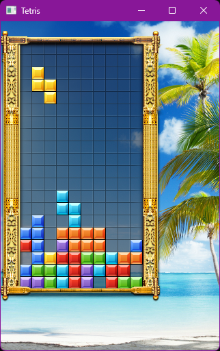

# Tetris en C++ con SFML



¡Bienvenido a Tetris en C++ con SFML! Este es un proyecto simple que recrea el clásico juego de Tetris utilizando el lenguaje de programación C++ y la biblioteca SFML (Simple and Fast Multimedia Library).

## Requisitos previos
- Compilador de C/C++ (mingw)

- SFML instalada y configurada correctamente.


## Compilación
1. Debes tener el proyecto con la siguiente estructura

````
.
📁tetris-sfml/
├── 📁src
│   └── main.cpp
├── 📁images/ 
├── 📁src/
│   ├── 📁include/ 
│   └── 📁lib/
├── Makefile
├── Archivos.dll
├── .gitingnore
└── README.md
````
- code: Directorio que contiene los archivos fuente (.cpp)

- src: Directorio que contiene los archivos de cabecera y bibliotecas de SFML.

- include: Archivos de cabecera (.h) necesarios para SFML.

- lib: Archivos de cabecera (.h) necesarios para SFML

- Makefile: Archivo Makefile para compilar y enlazar el proyecto.

- Archivos.dll: Estos debes descargarlos y copiarlos al proyecto.

- .gitignore: Se utiliza para que git ignore los archivos que no ser requiere versional (archivos binarios).

2. Valla a la terminal y escriba enl siguiente comando:
`````
> make
``````

3. Valla al explorador al directorio del proyecto y busque el archivo main.exe


